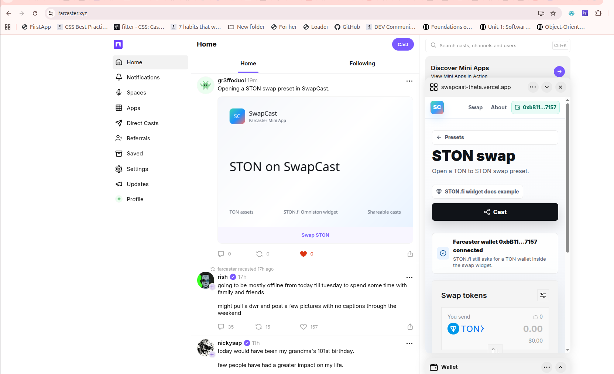

# SwapCast

SwapCast is a Farcaster Mini App for opening STON.fi Omniston-powered TON swaps from shareable Farcaster pages.

Live app: https://swapcast-theta.vercel.app  
Farcaster cast: https://farcaster.xyz/gr3ffoduol/0xc1537dc5



## Overview

SwapCast is built for Farcaster distribution. Users can open the Mini App from a cast, browse preset TON asset pages, load the embedded STON.fi Omniston widget, connect a TON wallet through TonConnect, and share swap pages back to Farcaster.

The app does not implement swap routing or transaction execution. STON.fi Omniston owns the swap interface, routing, wallet flow, and execution path.

## Features

- Mobile-first Next.js Mini App UI.
- Farcaster Mini App metadata and `/.well-known/farcaster.json`.
- STON.fi Omniston widget via `@ston-fi/omniston-widget-loader`.
- TonConnect manifest at `/tonconnect-manifest.json`.
- Generic `/swap` route and preset `/token/[symbol]` routes.
- Farcaster share/cast button.
- Farcaster EVM wallet detection and connect UI.
- Lightweight client-side analytics events.

## Routes

- `/` - landing page and token presets.
- `/swap` - generic swap widget page.
- `/token/ston` - TON to STON preset.
- `/token/usdt` - TON to USDt preset.
- `/token/ton` - USDt to TON preset.
- `/about` - short product overview.

## Local Development

Use Node `22.11+`.

```bash
npm install
cp .env.example .env.local
npm run dev
```

Open `http://localhost:3000`.

## Environment

```bash
NEXT_PUBLIC_APP_URL=http://localhost:3000

NEXT_PUBLIC_STONFI_REFERRER_ADDRESS=
NEXT_PUBLIC_STONFI_REFERRER_FEE_BPS=

FARCASTER_ACCOUNT_ASSOCIATION=
FARCASTER_ACCOUNT_ASSOCIATION_HEADER=
FARCASTER_ACCOUNT_ASSOCIATION_PAYLOAD=
FARCASTER_ACCOUNT_ASSOCIATION_SIGNATURE=
```

Set `NEXT_PUBLIC_APP_URL` to the public HTTPS origin in production. Farcaster account association values are required for a production-valid Mini App manifest.

## Verification

```bash
npm run typecheck
npm run lint
npm run build
```

## Notes

- Farcaster wallet connection shows the user's EVM address inside the Mini App.
- TON swaps still require a TON wallet through the Omniston/TonConnect flow.
- Use the Farcaster Mini App preview tool to test launch, sharing, and wallet behavior before submission.

## References

- STON.fi widget docs: https://docs.ston.fi/developer-section/widget/widget
- Farcaster Mini Apps docs: https://miniapps.farcaster.xyz/docs/getting-started
- Farcaster wallet docs: https://miniapps.farcaster.xyz/docs/guides/wallets
